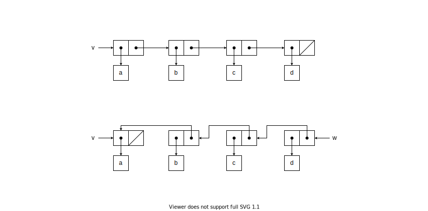

# Exercise 3.14

The following procedure is quite useful, although obscure:

```scheme
(define (mystery x)
  (define (loop x y)
    (if (null? x)
        y
        (let ((temp (cdr x)))
          (set-cdr! x y)
          (loop temp x))))
  (loop x '()))
```

Loop uses the *`temporary`* variable `temp` to hold the old value of the cdr of `x`, since the 
`set-cdr!`  on the next line destroys the cdr. Explain what mystery does in general. Suppose `v` is 
defined by `(define v (list 'a 'b 'c 'd))`. Draw the box-and-pointer diagram that represents the 
list to which `v` is bound. Suppose that we now evaluate `(define w (mystery v))`. Draw 
box-and-pointer diagrams that show the structures `v` and `w` after evaluating this expression. What
would be printed as the values of `v` and `w` ?

The function `mystery` has the effect of reversing the given list.



v:
```scheme
'(a b c d)
```

w:
```scheme
'(d c b a)
```
