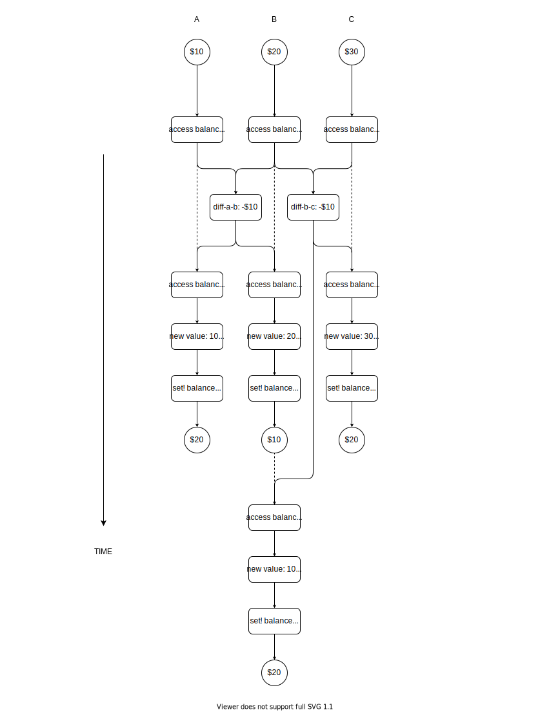
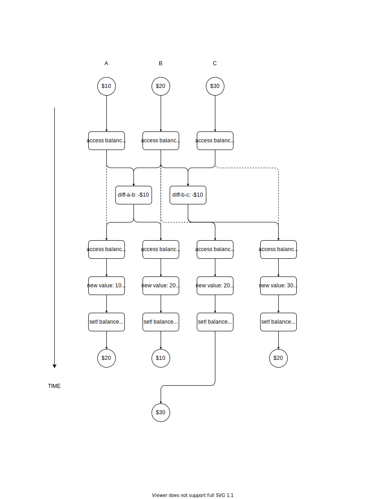

# Exercise 3.43

Suppose that the balances in three accounts start out as $10, $20, and $30, and
that multiple processes run, exchanging the balances in the accounts. Argue that
if the processes are run sequentially, after any number of concurrent exchanges,
the account balances should be $10, $20, and $30 in some order. Draw a timing
diagram like the one in figure 3.29 to show how this condition can be violated
if the exchanges are implemented using the first version of the account-exchange
program in this section. On the other hand, argue that even with this exchange
program, the sum of the balances in the accounts will be preserved. Draw a
timing diagram to show how even this condition would be violated if we did not
serialize the transactions on individual accounts.

#

## When seriliazing the transactions:

## Without seriliazing the the transactions:

